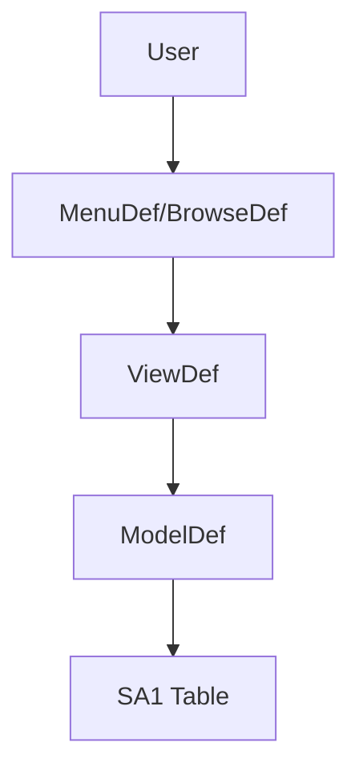

# Design

**Goal**: Define HOW to build it. Architecture, components, what to reuse.

**Skip this phase when:** The change is straightforward — no architectural decisions, no new patterns, no component interactions to plan. For simple features, design happens inline during Execute.

## Process

### 1. Load Context

Read `.specs/features/[feature]/spec.md` before designing. If `.specs/features/[feature]/context.md` exists, load it as well — it contains implementation decisions that constrain the design. Items marked "Agent's Discretion" are yours to decide.

### 1.5. Research (Optional but Recommended)

If the feature involves unfamiliar technology, patterns, or integrations, research before designing. Document findings briefly in the design doc or as inline notes. This prevents incorrect assumptions from cascading into tasks.

Follow the **Knowledge Verification Chain** (see SKILL.md) in strict order:

```
Codebase → Project docs → Web search (TDN) → Flag as uncertain
```

**CRITICAL: NEVER assume or fabricate information.** If you can't find an answer through the chain, explicitly say "I don't know" or "I couldn't find documentation for this". Inventing an API, pattern, or behavior that doesn't exist is far worse than admitting uncertainty. Wrong assumptions cascade through design → tasks → implementation.

**Validate ALL external symbols** (FW*/TC*/MS* classes, `xFilial`, `RetSqlName` functions, etc.) before writing any call.

Good triggers for research: new framework classes, REST APIs, patterns not used in this codebase before, security-sensitive features.

### 2. Define Architecture

High-level overview of how components interact. Use mermaid diagrams when useful. Before creating diagrams, check whether the `mermaid-studio` skill is available (see Skill Integrations in SKILL.md).

**For Protheus — choose the pattern:**
- **MVC (legacy/consolidated):** `ModelDef` + `ViewDef` + `BrowseDef` + `MenuDef` → `mvc-generator` skill
- **REST:** `@Get/@Post/...` annotations + `oRest` → `tlpp-rest-endpoint-generator` skill
- **Pure User Function/Static Function:** business logic without a screen

### 3. Identify Code Reuse

**CRITICAL**: What existing code can we leverage? This saves tokens and reduces errors.

If `.specs/codebase/CONCERNS.md` exists, check it before designing. Any component flagged as fragile, with tech debt, or with test coverage gaps requires extra care in the design.

**For Protheus — check:**
- Existing entry points in the module (`U_` functions)
- Reusable helper functions (`Static Function` in the same file or module)
- SQL query patterns already established in the codebase
- `.ch` constants already defined

### 4. Define Components and Interfaces

Each component: Purpose, Location, Interfaces, Dependencies, What it reuses.

**For Protheus — specify per layer:**
- Which dictionary table(s) will be affected? Consult the `data-dictionary-lookup` skill
- Which fields/indexes are relevant?
- Which `MV_` parameters will be queried?
- Which entry points will be created or affected?

### 5. Define Data Models

If the feature involves data, define models before implementation. For Protheus, this means mapping the table aliases (SA1, SE1, etc.) and the queries needed.

---

## Template: `.specs/[feature]/design.md`

````markdown
# [Feature] Design

**Spec**: `.specs/[feature]/spec.md`
**Status**: Draft | Approved

---

## Architecture Overview

[Brief description of the architectural approach]
[Chosen pattern: MVC / REST / pure User Function]



---

## Tables and Dictionary

| Alias | Physical table | Fields used | Index |
|---|---|---|---|
| SA1 | SA1010 | A1_COD, A1_NOME | 1 (A1_FILIAL+A1_COD) |

## Code Reuse Analysis

### Existing Components to Leverage

| Component | Location | How to Use |
|---|---|---|
| [Existing User Function] | `Fontes/Modulo/XXXX.prw` | [Call / Extend] |
| [Existing entry point] | `Fontes/Modulo/XXXX.prw` | [Reference] |

---

## Components

### [Component/User Function Name]

**Type:** User Function / Static Function / Class / MVC Model / REST Endpoint
**Location:** `Fontes/[Module]/[NAME].prw`
**Purpose:** [what it does]
**Interfaces:**
- Input: [parameters]
- Output: [return]
**Dependencies:** [other components, tables, parameters]
**Reuses:** [what it leverages from the existing codebase]

---

## Data Models / Queries

### [Query/Operation]

```sql
SELECT [fields]
FROM [RetSqlName('XXX')] XXX
WHERE XXX.X_FILIAL = xFilial('XXX')
  AND XXX.D_E_L_E_T_ = ' '
  AND [specific conditions]
  %nolock%
```

---

## Entry Points

| Entry Point | Event | PARAMIXB | Return |
|---|---|---|---|
| U_XXXX | [when it's called] | [structure] | [what it returns] |

---

## Open Questions

- [ ] [Unresolved question]
- [ ] [Pending decision]
````
